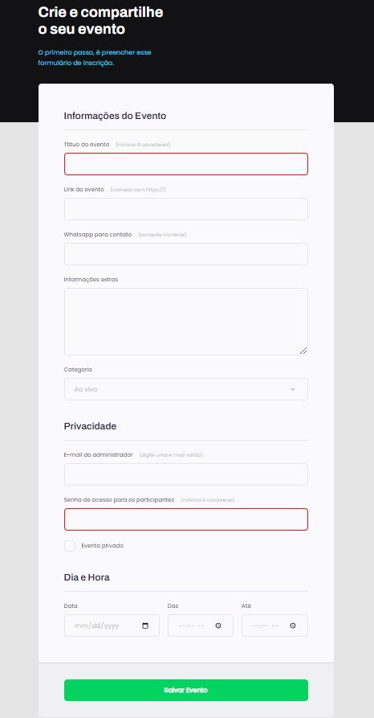

# stage03-projeto03

<h1 align="center"> Crie seu evento </h1>

O projeto "Crie seu evento" foi desenvolvido durante o stage 03 no Explorer da Rocketseat, sendo trabalhado, especificamente, os conceitos de formulário.  

  

## 🚀 Tecnologias

Esse projeto foi desenvolvido com as seguintes tecnologias:

- HTML e CSS
- Git e Github
- Figma

[Acesse o projeto finalizado, online](https://marcelgava.github.io/stage03-projeto03/)
